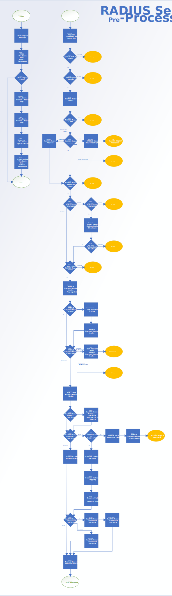
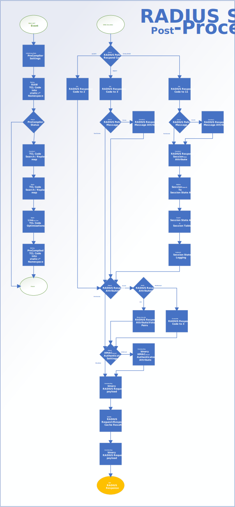

# Introduction

The iRule based RADIUS Server Stack can be used to turn a UDP-based Virtual Server into a flexible and fully featured RADIUS Server, including regular REQUEST/RESPONSE as well as CHALLENGE/RESPONSE based RADIUS authentication. The RADIUS Server Stack covers the RADIUS protocol core-mechanics outlined in [RFC 2865](https://tools.ietf.org/html/rfc2865) and [RFC 5080](https://tools.ietf.org/html/rfc5080) and can easily be extended to support every other RADIUS related RFC built on top of these specifications.

The RADIUS Server Stack can be used as an extension for LTMs missing RADIUS Server functionalities, as well as iRule command functionalities to support Self-Hosted RADIUS Server scenarios. 

***Note:** LTM provides a RADIUS Server Stack Profile to handle session persistence for RADIUS CHALLENGE/RESPONSE conversations, but it has no support to verify the integrity and origin of RADIUS requests. The various `[RADIUS::*]` iRule commands can be used to parse and modify incoming RADIUS requests in load-balancing scenarios, but they are not capable to craft RADIUS responses like the `[HTTP::*]` or `[ DNS::*]` iRule commands can do to support RADIUS Server services.*

# Design of the iRule based RADIUS Server Stack

The design goal of the RADIUS Server Stack was to simplify the RADIUS Policy creation as much as possible, so that integrators of this iRule don't need to be experts of the RADIUS protocol specification or full time TCL developers. All you need to know is how to write a custom RADIUS Policy with the help of LTMs `[IP::client_addr]` and `[RADIUS::avp]` iRule commands, have a brief understanding of the RADIUS attributes you are going to evaluate within your handcrafted RADIUS Policy and last but not least know how the RADIUS Server Stack Pre- and Post-Processors are getting plugged in.

The RADIUS Server Stack Pre- and Post-Processors are implemented by loading and storing TCL script code into global variables within the `$static::*` namespace. This step is performed by the provided iRule using a `RULE_INIT` event. The TCL script code stored in the `$static::*` variables can later be accessed and `[eval]` executed from various independent RADIUS Policy iRules, which are bound to their given UDP-based Virtual Server to represent a unique RADIUS Server instance. 

***Note:** If you have never worked with the `[eval]` command, then simply think of a classic macro recorder that stores and loads a TCL script to/from a `$static::*` variable, which is then inserted and executed at a given position of your custom RADIUS Policy iRule. It’s kind of a TCL procedure, only more in-line to the TCL code which has called the TCL macro code.*

The iRule sample below outlines how a basic RADIUS Policy may look like. It contains a mandatory RADIUS Client section to assign certain RADIUS Client specific configuration options. Furthermore, the execution of the RADIUS Server Stack Pre-Processor module, a custom RADIUS Policy section to evaluate the RADIUS request information and make a policy decision as well as the execution of the RADIUS Server Stack Post-Processor.

```
when CLIENT_DATA {

	#+ Assign RADIUS Client configuration

	if { [IP::client_addr] eq "10.10.10.10" } then {

		# String value used as RADIUS shared secret
		set client_config(shared_key)      "MySecureSharedKeyString"

		# Multi value to control HMAC-based Message authenticator attributes
		set client_config(require_hmac)    1   

		# Numeric value to limit RADIUS request per seconds
		set client_config(request_limit)   50                         

	} else {

		# Drop requests from unknown RADIUS clients
		UDP::drop                                               		
		return

	}

	#+ Execute RADIUS Server Stack Pre-Processor

	eval $static::RadSRV_PreProcessor

	#+ Evaluate RADIUS Policy

	if { ( [RADIUS::avp 1] eq "MyUser" ) 
	 and ( [RADIUS::avp 2] eq "MyP@ss1+" ) } then {

		# Set the RADIUS response code to ACCEPT the request
		set client_response(code)          "ACCEPT"

	} else {

		# Set the RADIUS response code to REJECT the request
		set client_response(code)          "REJECT"                    

	}

	#+ Execute RADIUS Server Stack Post-Processor

	eval $static::RadSRV_PostProcessor

}
```

***Note:** By storing the TCL code into global variables and executing them via TCLs `[eval]` command, it is possible to keep the calling iRule as well as the RADIUS Client Stack Processor in the same TCL execution level. This approach eliminates the need to map variables into/from a child execution level like regular `[call]` procedures would require. Compared to a `[call]` procedure, the `[eval]` based execution also adds less overhead, since it does not require any housekeeping’s to create and maintain a TCL child execution level. An interesting background information in regards to this approach is, that the second representation of the TCL scripts stored in the `$static::*` variables are getting [shimmered](http://wiki.tcl.tk/3033) on their first execution to bytecode. This behavior allows subsequent `[eval]` executions to reuse the already computed bytecode representation. Compared to in-line TCL code, the performance overhead of those consecutive `[eval]` executions are in the range of just a few CPU cycles and completely independent of the executed TCL script syntax and its size.*

# Functionality of the RADIUS Client section

The RADIUS Client section is responsible to identify the connecting RADIUS Client by its source IP address and to assign RADIUS Client specific settings. If a connecting RADIUS Client is unknown, the RADIUS Client section will simply `[UDP::drop]` and then return the iRule to silently discard the RADIUS request.
The mandatory configuration settings include the RADIUS secret (via `$client_config(shared_key)`), an option to control the HMAC-based Message-Authenticator attribute usage (via `$client_config(require_hmac)`) and an option to enforce individual request limits for a given RADIUS Client (via `$client_config(request_limit)`).

***Note:** The `$client_config(require_hmac)` variable controls the HMAC-based Message-Authenticator attribute usage for RADIUS requests and responses. If the variable is set to 0 (unsecure mode) the RADIUS Server Stack will not care about HMAC-based Message-Authenticator attributes in RADIUS requests and responses. If the variable is set to 1 (recommended mode) the RADIUS Server Stack will silently discard RADIUS requests with either a missing or an invalid HMAC-based Message-Authenticator attribute but will not include a HMAC-based Message-Authenticator attribute in its responses. If the value is set to 2 (slightly paranoid mode) the RADIUS Server Stack will silently discard RADIUS requests with either a missing or an invalid HMAC-based Message-Authenticator attribute and will additionally include a HMAC-based Message-Authenticator attribute in its responses.*

***Note:** Instead of using an if-then-else syntax, as shown in the example above, you could also implement a `[switch]` or `[class lookup]` based syntax to assign settings for your individual RADIUS clients. You may also want to add an `[IP::addr]` based syntax to the RADIUS Client section to assign RADIUS Client settings based on IP address subnet masks.*

# Functionality of the RADIUS Server Stack Pre-Processor module

The purpose of the RADIUS Server Stack Pre-Processor is to verify the protocol compliance, the integrity of the received RADIUS requests and the origin of the RADIUS requests. Furthermore, it is supposed to handle UDP as well as RADIUS protocol specific network communications before it would hit the customizable RADIUS Policy. The RADIUS Server Stack Pre-Processor should be seen as a traditional application layer filter in front of your custom RADIUS Policy. It parses, it adjusts, if necessary, it probably drops or directly responds to certain RADIUS requests and it also automates certain RADIUS protocol specific tasks, so that the RADIUS Policy can be used without paying any attention to the RADIUS protocol core-mechanic.

In detail the RADIUS Server Stack Pre-Processor module has the following functionalities:
-	Enforcement of high-performance global request rate limits
-	Verification and enforcement of RADIUS protocol compliance
-	Verification and enforcement of HMAC-based Message-Authenticator attribute usage
-	`[table]` driven enforcement of per RADIUS Client request rate limits
-	`[table]` driven UDP-packet deduplication and retransmit handling
-	`[table]` driven RADIUS CHALLENGE/RESPONSE session state handling
-	RADIUS Proxy-State attribute(s) relaying to support RADIUS proxies
-	Decryption of RADIUS request password values (PAP)
-	Comprehensive logging support with adjustable log-levels
-	Integrated `[ISTATS]` performance counters

# Workflow of the RADIUS Server Stack Pre-Processor module

The workflow below outlines the detailed logic of the RADIUS Server Stack Pre-Processor. 



# Code Documentation the RADIUS Server Stack Pre-Processor module

The TCL code of the RADIUS Server Stack Pre-Processor is documented with extensive Log/Debug messages to explain the used TCL syntax even for a non-developer. In combination with the provided workflow diagram, it should be easy for other TCL developers to dive into the code and implement changes.

# Functionality of the RADIUS Policy Section

After a RADIUS request has passed the RADIUS Server Stack Pre-Processor module, the RADIUS Policy section can safely inspect the RADIUS request attributes by utilizing LTM’s `[RADIUS::avp]` command to finally make a decision if the RADIUS request should become ACCEPT’ed, REJECT’ed or if additional RADIUS request roundtrips are required (aka. CHALLENGE/RESPONSE scenarios).

The samples below will show you which options are available to write a custom RADIUS Policy based on the provided RADIUS Server Stack.

## Example 1: Simple RADIUS Policy

The RADIUS Policy below checks the provided username and password values. If the username equals `MyUser` (RADIUS request attribute 1) and the password equals `MyP@ss1+` (RADIUS request attribute 2), the RADIUS request will be `ACCEPT`’ed. Otherwise, the RADIUS request will be `REJECT`’ed.

```
if { ( [RADIUS::avp 1] eq "MyUser" )
 and ( [RADIUS::avp 2] eq "MyP@ss1+" ) } then {

	# Set the RADIUS response code to ACCEPT the request
	set client_response(code)		"ACCEPT"

} else {

	# Set the RADIUS response code to REJECT the request
	set client_response(code)		"REJECT"

}
```

***Note:** The RADIUS Policy is free-text TCL code with full access to the received RADIUS request attributes and headers by using LTMs `[RADIUS::*]` commands. You may retrieve whatever information the RADIUS Client has passed (e.g. NAS-ID-attribute) and use whatever mechanism you like to evaluate the retrieved information (e.g. Data-Groups, Sideband, iRuleLX or APM).*

***Note:** The RADIUS Password attribute (attribute 2) has been decrypted in the background by the RADIUS Server Stack Pre-Processor module and then injected back to the RADIUS request. All remaining RADIUS request attributes are left unchanged, so you may have to decode other attributes before using them. For a comprehensive list of the available RADIUS request attributes and their data-types, refer to the [IANA web site](https://www.iana.org/assignments/RADIUS-types/RADIUS-types.xhtml).*

## Example 2: Simple CHALLENGE/RESPONSE RADIUS Policy

The RADIUS Policy below checks the provided username, password, and an OTP value by using a RADIUS CHALLENGE/RESPONSE mechanism. The RADIUS Policy captures the username (RADIUS attribute 1) and password (RADIUS attribute 2) value of an initial RADIUS request an stores it into the `$session_state()` array variable for later use. It then asks the RADIUS Client to provide additional authentication information by passing the RADIUS Reply-Message attribute “Please enter your OTP code?” and setting the RADIUS response code to CHALLENGE. If the RADIUS Client replies to the CHALLENGE, the RADIUS Policy can access the previously stored `$session_state(username)` and `$session_state(password)` variables, so that the just provided OTP value (RADIUS attribute 2 of the second request) can be evaluated altogether to finally reply either with an `ACCEPT` or `REJECT` response.

```
if { $session_state(action) eq 1 } then {

	# Set the RADIUS response code to CHALLENGE additional information
	set client_response(code)        "CHALLENGE"

	# Set the display message for the RADIUS client
	set client_response(message)     "Please enter your OTP code?"

	# Store the received username to the session table
	set session_state(username)      [RADIUS::avp 1]

	# Store the received password to the session table
	set session_state(password)      [RADIUS::avp 2]

	# Change the action variable so that subsequent requests will trigger a different code path
	set session_state(action)        2

} elseif { $session_state(action) eq 2 } then {

	if { ( $session_state(username) eq "MyUser" )
	 and ( $session_state(password) eq "MyP@ss1+" )
	 and ( [RADIUS::avp 2] eq "123456" ) } then {

		# Set the RADIUS response code to "ACCEPT" the request
		set client_response(code)   "ACCEPT"

	} else {

		# Set the RADIUS response code to "REJECT" the request
		set client_response(code)   "REJECT"

	}
}
```

***Note:** The CHALLENGE/RESPONSE mechanism of the RADIUS Server Stack utilizes a `$session_state()` array variable to exchange request information between subsequent RADIUS requests related to the same RADIUS CHALLENGE/RESPONSE conversation. Whatever you put into such `$session_state(YourVARName)` variables will be saved by the RADIUS Server Stack Post-Processor into LTMs session table with a reference of the originating RADIUS request (sort of a cookie value exchanged between the RADIUS Server and client). If the RADIUS Client is responding back to the CHALLENGE it will send this reference, so that the RADIUS Server Stack Pre-Processor module can restore the `$session_state()` variables to the state of the last RADIUS request.*

***Note:** The $session_state(action) variable gets initialized by the RADIUS Server Stack Pre-Processor to the value 1 for every new RADIUS session. If a RADIUS request provides a reference to an existing RADIUS CHALLENGE/RESPONSE session, then the last value of the `$session_state(action)` variable will be restored. You may chain as many subsequent CHALLENGE/RESPONSE round trips into a single RADIUS session. By doing so you could basically ask for a 10-factor authentication by verifying a couple independent token codes or even checking the user’s shoes size, age, gender, pets name or whatever information you like. You may also set the `$session_state(action)` to a previous value to ask the user to provide certain information a second time.*

***Note:** The CHALLENGE/RESPONSE mechanism allows you to perform either a classical step-up verification, where each CHALLENGE round trip already authenticates certain authentication information, or you can simply collect all required information by using multiple CHALLENGE round trips and then authenticate them all together at the end of the CHALLENGE/RESPONSE conversation in the order you like.*

***Note:** The CHALLENGE/RESPONSE mechanism of the RADIUS protocol is more-or-less a generic approach to support RADIUS conversations that require multiple round trips between RADIUS Clients and RADIUS Servers. Instead of sending a reply-message to the RADIUS Client and asking for another PAP based password, the CHALLENGE/RESPONSE mechanism may also be used in combination with other RADIUS request or response attributes to support various other RADIUS related RFCs (e.g. MSCHAP, EAP).*

***Note:** In some cases you may have to store binary information (e.g. passwords containing special character sets) into a `$session_state()` variable. The mechanism used to save and restore those information to/from LTMs session table will silently change the encoding to UTF-8, so that you have to utilize a `[binary format A* $session_state(MyBinaryVar)]` syntax to format the value back to its binary representation.*

## Example 3: Sending RADIUS responses with additional response attributes

In case you need to send some custom RADIUS response attributes to your RADIUS Client, you can pass a user-friendly attribute list to the RADIUS Server Stack Post-Processor so that it includes those attributes in its response. The RADIUS response attribute list is built by creating a three-part value pair specifying the Attribute-ID, Attribute-Format and Attribute-Value.

```
if { ( [RADIUS::avp 1] eq "myuser" ) 
 and ( [RADIUS::avp 2] eq "MyP@ss1+" ) } then {

	# Set the RADIUS response code to "ACCEPT" the request
	set client_response(code)               "ACCEPT"

	# Store the value raw value "Hello World" into attribute 11
	lappend client_response(attributes) 11   string   "Hello World"
	# b64decode the value "SGVsbG8gV29ybGQ=" and store it into attribute 12
	lappend client_response(attributes) 12   base64   "SGVsbG8gV29ybGQ="
	# Store the value "123" as 16-bit integer into RADIUS attribute 13
	lappend client_response(attributes) 13   int16    "123"
	# Store the value "234" as 32-bit integer into RADIUS attribute 14
	lappend client_response(attributes) 14   int32    "234"
	# Store the value "345" as 64-bit integer into RADIUS attribute 15
	lappend client_response(attributes) 15   int64    "345"
	# Decode the hexadecimal value "AFFEAFFE" and store it into attribute 16
	lappend client_response(attributes) 16   hex      "AFFEAFFE"
	# Decode the IPv4 notation and store it into attribute 17
	lappend client_response(attributes) 17   ipv4      "10.10.10.10"
	# Decode the IPv4 subnet-notation and store it into attribute 18
	lappend client_response(attributes) 18   ipv4prefix    "10.10.10.0/24"

} else {

	# Set the RADIUS response code to "REJECT" the request
	set client_response(code)               "REJECT"

	# Optional text message for the RADIUS Client (if supported)
	set client_response(message)            "Access denied by RADIUS Policy"

}
```

***Note:** The RADIUS Server Stack takes care of the RADIUS attribute 18 (aka. Reply-Message) by setting the desired response message into the `$client_response(message)` variable. Keep in mind that the `$client_response(message)` variable will be omitted for every `ACCEPT` response to achieve RFC compliance.*

***Note:** The RADIUS Server Stack automatically takes care of the RADIUS attribute 24 (Proxy-State). No further action is required to support RADIUS proxy servers.*

# Functionality of the RADIUS Server Stack Post-Processor

The purpose of the RADIUS Server Stack Post-Processor is to provide a replacement for LTMs missing `[RADIUS::*]` commands required to support RADIUS services. The RADIUS Server Stack Post-Processor should be seen as TCL command extension to assist your custom RADIUS Policy to construct and send qualified RADIUS responses after a policy decision has been made. Like the RADIUS Server Stack Pre-Processor module, it does also automate certain RADIUS protocol specific tasks, so that the RADIUS Policy can be used without paying any attention to the RADIUS protocol core-mechanics.

In detail the RADIUS Server Stack Post-Processor has the following functionalities:
-	Simplified RADIUS response construction
-	Simplified RADIUS response attribute construction
-	Optional calculation of a HMAC-based Message-Authenticator attribute
-	`[table]` driven UDP-packet retransmit handling
-	`[table]` driven RADIUS CHALLENGE/RESPONSE session state handling
-	RADIUS Proxy-State attribute relaying to support RADIUS Proxies
-	Comprehensive logging support with adjustable log-levels
-	Integrated `[ISTATS]` performance counters

# Workflow of the RADIUS Server Stack Post-Processor

The workflow below outlines the detailed logic of the RADIUS Server Stack Post-Processor. 



# Code Documentation the RADIUS Server Stack Post-Processor

The TCL code of the RADIUS Server Stack Post-Processor is documented with extensive Log/Debug messages to explain the used TCL syntax even for a non-developer. In combination with the provided workflow diagram, it should be easy for other TCL developers to dive into the code and implement changes.

# Installation of the RADIUS Server Stack

To install the RADIUS Server Stack on F5 LTM and to turn a UDP-based Virtual Server into your custom RADIUS Server instance, you need to perform the steps below:

***Note:** Before deploying the RADIUS Server Stack in your production environment it is highly recommended to get familiar with the creation of RADIUS Policy Scripts and the adjustment of the included Pre-Compiler Framework in your F5 LTM test or development environment.*

1.	Create a new empty iRule on your F5 LTM System and copy the TCL Code of the RADIUS Server Stack into the just created iRule. Press Save to deploy the global variables containing the RADIUS Server Pre- and Post-Processor on your system.
2.	Create a new UDP-Profile and enable the UDP datagram LB option.
```
ltm profile udp udp_datagram {
     app-service none
     datagram-load-balancing enabled
     defaults-from udp
}
```
3.	Create a new UDP-based Virtual Server and assign the just created UDP-Profile to it. Keep in mind that you don’t need to attach LTMs RADIUS Server Stack Profile to this Virtual Server since it won’t provide any benefits for a RADIUS Server.
```
ltm virtual VS_MyRADIUSServerInstance_UDP1812 {
     destination 192.168.0.1:1812
     ip-protocol udp
     mask 255.255.255.255
     profiles {
         udp_datagram { }
     }
     source 0.0.0.0%1/0
     translate-address enabled
     translate-port enabled
}
```
4.	Write your custom RADIUS Policy iRule as described in this document and assign it to the just created UDP-based Virtual Server.
5.	Point a RADIUS Client to the just created Virtual Server to test your custom RADIUS Server solution.

# About

The following chapters are uses to describe development considerations as well as even and odds of the RADIUS Server Stack. 

## Security

The RADIUS Server Stack has been designed, developed and intensively tested to allow stable operations on mission critical and hostile LTM environments. The entire RADIUS request payload gets verified by the RADIUS Server Stack Pre-Processor module to avoid annoying TCL stack traces caused by LTMs slightly unstable `[RADIUS::*]` commands. In addition, the maximum throughput of the RADIUS Server Stack as well as the maximum number of RADIUS requests for a single RADIUS Client can be restricted, to make sure that an unintended network flood or a bad guy can’t take down your LTM, by either exhausting LTMs CPU and memory resources or overloads your backend repositories.

In addition, the implementation of the HMAC-based Message-Authenticator RADIUS protocol extension can be used to fully Pre-Authenticate the RADIUS requests before any memory intensive operation is performed or backend repositories are queried.

## Performance

The RADIUS Server Stack has been developed by using a layered approach and carefully chosen TCL syntax to sort out illegitimate requests as fast as possible and to be CPU and memory friendly as much as possible for the remaining requests. If you can provide ideas to further optimize the performance of the RADIUS Server Stack without limiting its usability or security, I would be very happy to get your feedback.

## UDP connection handling

A RADIUS protocol conversation is based on a multiplexed UDP connection where the RADIUS Client may asynchronously send up to 255 independent RADIUS requests over a single UDP-connection (aka. `SRC-IP/SRC-Port` <> `DST-IP/DST-Port` combination). To support such an operation mode, the Virtual Server must be enabled to use the Datagram-Load Balancing mode, so that each received UDP-Datagram creates its own (virtual) UDP-Connection and gets processed independently. Without enabling the Datagram-Load Balancing mode, the receipt of a RADIUS request would set the underlying UDP-connection into a blocking state until the RADIUS Policy has been completely processed. This may add an unacceptable authentication delay for multiplexed RADIUS requests and may cause RADIUS requests to timeout and even cause UDP buffer overruns.

## UDP deduplication and retransmit handling

Since the RADIUS protocol is based on the UDP protocol, an application specific mechanism must be implemented to handle the state-less nature of UDP traffic. The RADIUS Server Stack includes a very efficient method to detect and filter duplicated RADIUS requests (either due to network related problems, like switch floods or due to RADIUS clients with very aggressive RADIUS request retransmissions) and provides a short living RADIUS response cache to retransmit a previously processed RADIUS response. The implemented approach makes sure that the initial and a possible re-transmitted RADIUS request is processed only once by the RADIUS Policy and ensures ordered delivery for CHALLENGE/RESPONSE based RADIUS authentications.

***Note:** The RADIUS Server Stack uses a highly optimized RADIUS request and response cache based on runtime-discovered `[table -subtable]` locations to eliminate TMM [connection parking situations](https://community.f5.com/t5/technical-articles/irules-concepts-connection-states-and-command-suspension/ta-p/275854). The idea behind this approach is, that the RADIUS response cache does not need to share any data across different TMM-cores, since a given UDP-connection would always be handled by the same TMM-core. On the other hand, the `[table]` command would normally store the table data in a [CMP-compliant](https://community.f5.com/t5/technical-articles/the-table-command-the-fine-print/ta-p/278480) fashion, so that a given `[table]` or `[table –subtable]` (and all of its `-subtable` entries) record will become hash-distributed to either the local or to a remote TMM core. The magic of the highly optimized RADIUS request and response cache happens on each TMM core individually, when the very first RADIUS request is processed after a given TMM process initializes. After initialization, the TMM currently in charge to process a just received RADIUS request will perform a couple `[table]` lookups for non-existent data in random `-subtable` locations and measure the individual command execution times. The TMM core will create a list of `[table –subtable]` locations which responded much faster (aka. lookups targeting the local TMM) than the others (aka. lookups targeting a remote TMM). Once the list has been created, the TMM core simply chooses the fastest responding `[table –subtable]` location and saves the name into the `$static::local_tmm_subtable` variable as a reference for every subsequent RADIUS request and response cache lookup. Since every TMM-core will discover the fastest responding `-subtable` location independently, each TMM-core will finally use a unique `[table –subtable]` location which gets always hash-distributed to the local TMM-core.*

## Logging and ISTATS performance counters

The RADIUS Server Stack includes comprehensive logging information. The configurable log level is based on syslog severity numbers (1=Emergency to 8=line-by-line debug tracing) and allows you to either get minimal audit logs (e.g. which user has been granted/denied access) or to trace the entire TCL execution path of the currently processed RADIUS request. The log lines can also be seen as a rich documentation of the individual lines of code to allow other peers to review and understand the source code of the RADIUS Server Stack.

In addition to that, the RADIUS Server Stack includes several `[ISTATS]` performance counters to collect operational statistics. The `[ISTATS]` performance counters are getting collected and stored with a reference to the Virtual Server which has received the RADIUS request and can then be viewed by using the TMSH syntax `show ltm virtual VS_MY_RADIUS` (replace `VS_MY_RADIUS` with the name of your Virtual Server).

## TCL Pre-Compiler Framework

As already mentioned, the RADIUS Server Stack Pre- and Post-Processors are implemented by storing TCL code into global variables within the `$static::*` namespace. By storing the TCL code in those variables, a TCL Pre-Compiler Framework can optionally be used to read, and run-time optimize the stored TCL code before it’s getting executed subsequently.

Using a TCL Pre-Compiler Framework basically allows an iRule developer to write human-friendly and as flexible as possible TCL code, but without sacrificing the execution speed of the iRule because of too much granularity. 

A TCL Pre-Compiler Framework allows you to put lots of `if { $static::config_option == 1 } then { #do something }` into the code as usual, but instead of evaluating such conditional code on each execution, the TCL Pre Compiler Framework can simply remove such TCL code blocks, based on the currently configured global (and rather static) options, before the TCL code is getting executed subsequently. 

A TCL Pre-Compiler Framework may also resolve the values of `$static::config_options` and replace any reference to those variables in your iRule with the actual value, so that the TMM data-plane does not need to look up the rather static values subsequently. 

A TCL Pre-Compiler Framework may also be used to compress/shrink the local `$variable names` to speed up their lookups, and even combine two or more independent `$variables` names into a shared name to reduce the total number of the created `$variables` to a minimum. Keep in mind, that every single `$variable` requires CPU cycles for its creation and is also wasting memory if you keep them longer than needed. 

Last but not least a TCL Pre-Compiler Framework can simplify iRule development by replacing shortcut-strings (e.g. `#log7`) with actual TCL code (e.g. `log local0.debug "Logprefix : [virtual] : $request_id)` to make writing TCL code more efficient and fun as well.

The provided TCL Pre-Compiler Framework may be used to optimize the RADIUS Server Stack by:

-	Selectively enable `[log]` support based on configurable severity levels
-	Selectively enable `$session_state()` array export/import debug logging in CHALLENGE/RESPONSE scenarios
-	Selectively enable `[ISTATS]` performance counters
-	Selectively enable a debug mode for local TMM `[table -subtable]` discoveries
- Selectively enable TCL script compression by:
  - Resolving and hardcoding the values of `$static::*` configuration options
  - Compressing local `$variable` names either to a unique or shared naming convention
  - Removing unnecessary script lines and comments

***Note:** The TCL Pre-Compiler Framework is included at the bottom of the provided iRule. By keeping everything in the same iRule, it is guaranteed that a change to the global configuration options or the TCL code of the RADIUS Server Stack will result in a fresh pre-compilation of the RADIUS Server Stack Pre- and Post-Processor modules. On each saving, the iRule will reapply the global configuration, deploy the raw TCL code into the `$static::*` variables and then execute the TCL Pre-Compiling Framework to optimize the code based on the current configuration options and finally store the optimized TCL code.*

***Note:** You can view the results of the TCL Pre-compiling framework by dumping the content of the Pre- and Post-Processors variables. The most elegant way to display the pre-compiled TCL code is to create a HTTP based Virtual Server and attach an iRule to it, which then reads the `$static::RadSRV_PreProcessor` and `$static::RadSRV_PostProcessor` variables and outputs their content via the `[HTTP::respond]` command to your browser (see sample iRule below).*

```
when HTTP_REQUEST {
    #log "Constructing the HTTP Response content."
    set temp(http_response) \
"
# RadSRV PreProcessor Code:

set static::RadSRV_PreProcessor \{
$static::RadSRV_PreProcessor
\}

# RadSRV PostProcessor Code:

set static::RadSRV_PostProcessor \{
$static::RadSRV_PostProcessor
\}
"
    #log "Sending the HTTP response."
    HTTP::respond 200 content $temp(http_response) "Content-Type" "text/txt"
}
```

***Note:** The TCL Pre-Compiler Framework is an optional component. You can use the provided RADIUS Server Stack code without any pre-compilings by either disabling or removing the TCL Pre-Compiler Framework and then `[eval]` the raw TCL code of the `$static::*` variables. But keep in mind, that some functionality of the RADIUS Server Stack is then left commented out and you need to change the provided code manually. A slightly more streamlined solution would be to use the TCL Pre-Compiling Framework in a dev environment, extract the pre-compiled TCL code and finally copy it to your production environment. You may also consider to skip the `[eval]`-based execution and integrate the pre-compiled TCL code directly in your custom RADIUS Policy iRule at the position where you would normally `[eval]` the code stored in the `$static::*` variables. But keep in mind that the total size of an iRule is limited to slightly less than 64k bytes.*
